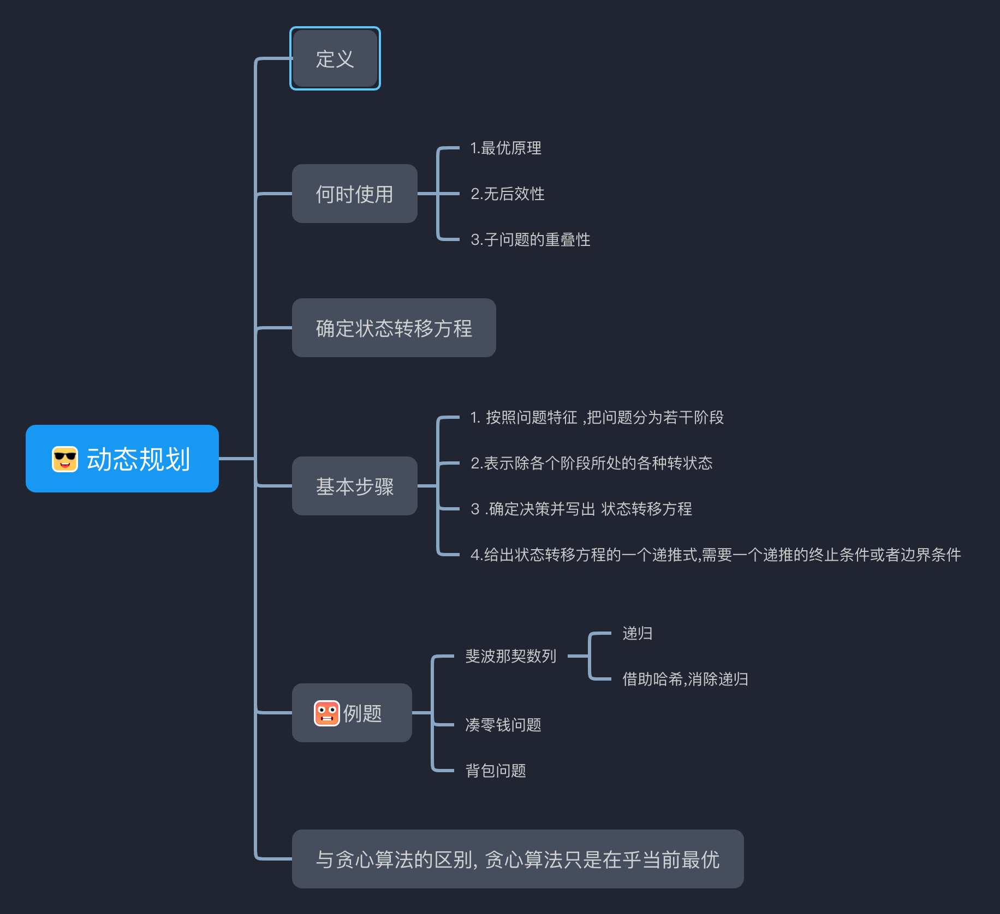

# 动态规划问题（Dynamic Programming）

## 定义
动态规划问题(Dynamic Programming)是指在求解问题中,对于每一步决策 ,列出各种问题的局部解,
在依据某个条件,舍弃那些肯定不能得到的最优解的局部解,在每一步都经过筛选,以每一步都是最优解来保证全局最优解

## 何时使用
1.最优原理
2.无后效性
3.子问题的重叠性
题目中也常常会出现一些，求最大，最小，或者最优的字眼。

## 基本步骤

1.按照问题特征 ,把问题分为若干阶段
2.表示除各个阶段所处的各种转状态
3.确定决策并写出 状态转移方程
4.给出状态转移方程的一个递推式,需要一个递推的终止条件或者边界条件

看似简单，但是在应用时常常不能很快的找到状态方程。
与贪心算法的区别,  贪心算法只是在乎当前最优。

明确状态，状态选择
确定状态转移方程

与贪心算法的区别, 贪心算法只是在乎当前最优

贪心算法每次在局部取最大的value 在有些情况下得不到最优解。
例如： 最少硬币找零问题中
GiVEN COIN = {1,8,13} , sum = 16;
如果贪心算法： 取值为  13 + 1 + 1 + 1 +1 = 16
但是显然 ： 8 + 8 = 16

### example
[使用最小花费爬楼梯_leetCode746](https://leetcode.cn/problems/min-cost-climbing-stairs/)

[第 N 个泰波那契数_leetCode1137](https://leetcode.cn/problems/n-th-tribonacci-number/)

[斐波那契数 leetCode509](https://leetcode-cn.com/problems/fibonacci-number/)

上面2个题目解法相似

[打家劫舍_leetCode198](https://leetcode.cn/problems/house-robber/submissions/)

[零钱兑换 leetCode322](https://leetcode-cn.com/problems/coin-change/)

[完全平方数_leetcode279](https://leetcode-cn.com/problems/perfect-squares/)

## 双指针
 i , j 一前一后 ,  i++, j-- ,  i >j 的时候结束,双向变动.

>example

[字符串反转 leetcode345](https://leetcode-cn.com/problems/reverse-vowels-of-a-string/)
[判断子序列 ](https://leetcode-cn.com/problems/is-subsequence/)
[三个数求和 leetcode16]()
[leetcode 11](../src/main/../../../src/main/java/arrays/leetCode66.java)
[快乐数 leetcode202](../src/main/../../../src/main/java/strRelated/leetcode202.java)

>example:

## 贪心

>example:

[最长长回文数 leetcode409](https://leetcode-cn.com/problems/longest-palindrome/)

## 二分查找

1.从中间开始查找
2.向左或者向右 (left = mid +1 or  right = mid + 1)。
3.左右互换了(left > right  or  right > left) ,则停止。

>example

[leetcode 441](https://leetcode-cn.com/problems/arranging-coins/)

[leetcode 374]()