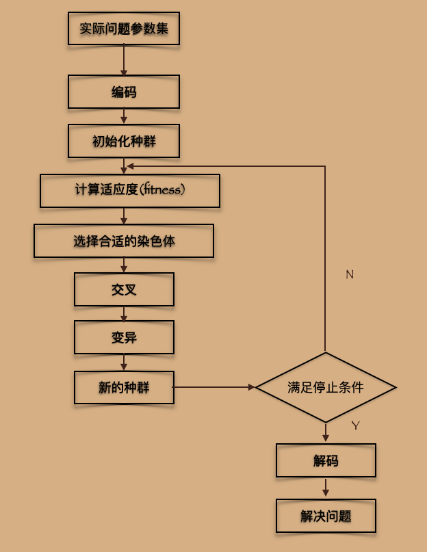

遗传算法 (Genetic Algorithm， GA）是模拟生物在自然环境中的遗传和进化的过程而形成的自适应
全局优化搜索算法。

遗传算法借鉴了达尔文的进化论和孟德尔的遗传学说。其本质是一种并行、高效、全局搜索的方法，
它能在搜索过程中自动获取和积累有关搜索空间的知识，并自适应地控制搜索过程以求得最优解。遗传
算法操作使用“适者生存〞的原则，在潜在的解决方案种群中逐次产生一个近似最优的方案。在遗传算
法的每一代中，根据个体在门题域中的适应度值和从自然遗传学中借鉴来的再造方法进行个体选择，产
生
一个新的近似解。这个过程导致种群中个体的进化，得到的新个体比原个体更能适应环境，就像自然
界中的改造一样。

遗传算法是从代表问题可能潜在的解集的一个种群（ population）开始的，而一个种群则由经过基因（gene ）编码的-
定数目的个体(individual)组成。因此，第一步需要实现从表现型到基因型的映射即编码工作。初代种群产生之后，按照
适者生存和优胜劣汰的原理，逐代(generation）演化产生出越来越好的近似解，在每一代，根据问题域中个体的适应度
(fitness）大小选择个体，并借助于自然遗传学的遗传算子( genetic operators ）进行组合交叉和变异，产生出代表新
的解集的种群。这个过程将导致种群像自然进化一样，后生代种群比前代更加适应于环境，末代种群中的最优个体经过解
码（decoding），可以作为问题近似最优解。

遗传算法有三个基本操作：选择（Selection）、交叉（Crossover）和变异 ( Mutation )。
（1）选择。选择的目的是为了从当前群体中选出优良的个体，使它们有机会作为父代为下一代繁行子孙。根据各个个体的
适应度值，按照一定的规则或方法从上一代群体中选择出一些优良的个体遗传到下一代种群中。选择的依据是适应性强的
个体为下一代贡献一个或多个后代的概率大。
•（2）交叉。通过交叉操作可以得到新一代个体，新个体组合了父辈个体的特性。将群体中的各个个体随机搭配成对，对每
一个个体，以交叉概率交换它们之间的部分染色体。
（3）变异。对种群中的每一个个体，以变异概率改变某一个或多个基因座上的基因值为其他的等位基因。同生物界中一样
变异发生的概率很低，变异为新个体的产生提供了机会。

基本步骤 :
1. 编码：GA在进行搜索之前先将解空间的解数据表示成遗传空间的基因型串结构数据，
   这些串结构数据的不同组合便构成了不同的点
2. 初始群体的生成：随机产生N个初始串结构数据，每个串结构数据称为一个个体，N个体构成了一个群体。GA以这N个串结构数据作为初始点开始进化
3. 适应度评估：适应度表明个体或解的优劣性。不同的问题，适应性西数的定义方式也不同

二进制编码：用一个二进制串表示这个十进制数值。
给定数值解的区问范围：[1,10]。
给定精度：1e-5，两个数值解的间隔。
• 进行编码：为每个数值解分配
- 个独—无二的二进制串。

mathleb 工具箱 gadst，gatbx，gaot

## 粒子蚁群算法
